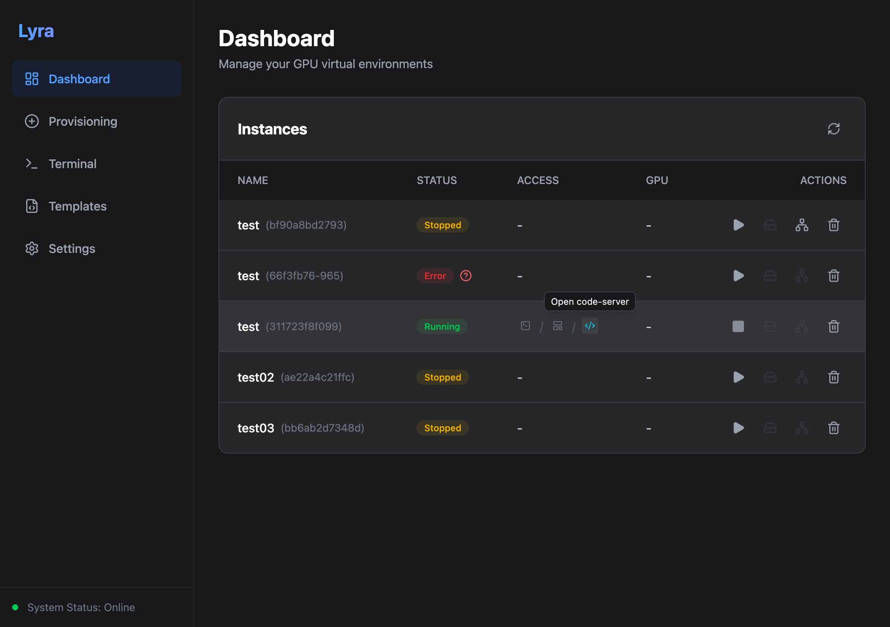

# Lyra

[](https://github.com/hololee/Lyra/actions/workflows/backend-ci.yml)
[](https://github.com/hololee/Lyra/actions/workflows/frontend-ci.yml)

Lyra is a web application designed to manage GPU-enabled build environments and containers effortlessly.



## Quick Start

Server deployment guide: [`INSTRUCTIONS.md`](INSTRUCTIONS.md)

### Prerequisites
- Docker & Docker Compose
- Python 3.11+ (for local development)
- Node.js 20+ (for local development)

### Running with Docker Compose

Before running compose, create `.env`:
```bash
cp .env.sample .env
```
At minimum, set secure values for:
- `APP_SECRET_KEY` (valid Fernet key, base64-encoded 32-byte key)
- `POSTGRES_PASSWORD`

**Default (CPU-only):**
```bash
docker-compose up -d --build
```

**With GPU Support (NVIDIA):**
```bash
docker-compose -f docker-compose.gpu.yml up -d --build
```

- **Frontend**: [http://localhost](http://localhost)
- **Backend API**: [http://localhost:8000](http://localhost:8000)
- **API Docs**: [http://localhost:8000/docs](http://localhost:8000/docs)

---

## Deployment Checklist

Use this section when deploying to a server (IP/domain), not localhost-only development.

1. Create environment file:
```bash
cp .env.sample .env
```

2. Set required `.env` values:
```bash
POSTGRES_USER=postgres
POSTGRES_PASSWORD=CHANGE_THIS_DB_PASSWORD
POSTGRES_DB=lyra
DATABASE_URL=postgresql+asyncpg://postgres:CHANGE_THIS_DB_PASSWORD@db/lyra
CELERY_BROKER_URL=redis://redis:6379/0
CELERY_RESULT_BACKEND=redis://redis:6379/0
APP_SECRET_KEY=REPLACE_WITH_VALID_FERNET_KEY
ALLOW_ORIGINS=http://YOUR_SERVER_IP,https://YOUR_DOMAIN
SSH_HOST_KEY_POLICY=reject
SSH_KNOWN_HOSTS_PATH=/root/.ssh/known_hosts
```

- `APP_SECRET_KEY` is required for root password encryption/decryption.
- `POSTGRES_PASSWORD` and `DATABASE_URL` credentials must match.
- If `POSTGRES_USER` or `POSTGRES_DB` is changed, update `DATABASE_URL` accordingly.
- `ALLOW_ORIGINS` must include the exact browser origin(s) that will access Lyra.
  - If users open `http://<server-ip>`, include `http://<server-ip>`.
  - If users open `https://example.com`, include `https://example.com`.
- If external DB/Redis access is not needed, do not expose `5432`/`6379` outside trusted networks.

3. Run deployment:
```bash
docker compose up -d --build
```
GPU hosts:
```bash
docker compose -f docker-compose.gpu.yml up -d --build
```

4. Verify containers:
```bash
docker compose ps
```

---

## Project Structure

```text
.
├── backend/               # FastAPI + Celery + SQLAlchemy
│   ├── app/               # Application logic (routers, models, tasks)
│   ├── tests/             # Pytest suite
│   └── Dockerfile         # Python environment definition
├── frontend/              # React + Vite + TailwindCSS
│   ├── src/               # Application components and pages
│   └── Dockerfile         # Nginx-based frontend deployment
├── docs/                  # Project documentation & TODOs
├── .github/workflows/     # GitHub Actions CI/CD pipelines
├── .pre-commit-config.yaml# Local CI check configuration
└── docker-compose.yml     # Service orchestration
```

---

## Local Development & CI

### Pre-commit Hooks
This project uses `pre-commit` to ensure code quality locally. To set it up:

```bash
pip install pre-commit
pre-commit install
```

Now, every `git commit` will automatically run linting (`flake8`, `eslint`) and tests (`pytest`).

### Manual CI Run
You can manually run all checks across the codebase:
```bash
pre-commit run --all-files
```

Backend tests (recommended invocation):
```bash
cd backend && pytest -q
```

### Database Migrations
This project uses **Alembic** for handling database schema changes.

**Create a new migration** (after modifying `models.py`):
```bash
docker compose exec backend alembic revision --autogenerate -m "Description of changes"
```

**Apply migrations to DB**:
```bash
docker compose exec backend alembic upgrade head
```

`Environment` now includes optional service flags in API payloads:
- `enable_jupyter` (default: `true`)
- `enable_code_server` (default: `true`)

---

## Settings API Policy

`PUT /api/settings/{key}` only allows direct updates for:

- `app_name`
- `favicon_data_url`
- `dashboard_announcement_markdown`
- `ssh_port`
- `ssh_host`
- `ssh_username`
- `ssh_auth_method`
- `ssh_password`
- `ssh_host_fingerprint`

Internal keys are protected and cannot be directly accessed/updated:

- `jupyter_token:*`
- `custom_ports:*`

Error policy:

- `400` for invalid or unsupported keys
- `403` for protected internal keys

---

## SSH Host Key Policy

- Backend enforces SSH host key verification for both:
  - `POST /api/terminal/test-ssh`
  - `GET /api/terminal/ws` (websocket terminal path)
- Policy mode is controlled by `SSH_HOST_KEY_POLICY`:
  - `reject` (recommended): unknown/untrusted host keys are rejected
  - `accept-new` (development only): unknown keys are auto-accepted
- `SSH_KNOWN_HOSTS_PATH` points to the known_hosts file used for trust checks.
- If `ssh_host_fingerprint` setting is configured, fingerprint validation is applied before authentication and takes precedence over implicit trust.
- Fingerprint formats:
  - `SHA256:<base64>`
  - MD5 fingerprint (`aa:bb:...`) also supported for compatibility

### Pre-register known_hosts (recommended for `reject`)

`SSH_KNOWN_HOSTS_PATH` is resolved inside the backend container.
Pre-register target host keys before users open Terminal:

```bash
docker compose exec backend sh -lc 'mkdir -p /root/.ssh && ssh-keyscan -H <SSH_HOST> >> /root/.ssh/known_hosts'
```

Example:

```bash
docker compose exec backend sh -lc 'mkdir -p /root/.ssh && ssh-keyscan -H host.docker.internal >> /root/.ssh/known_hosts'
```

### Pin host fingerprint via setting (optional hardening)

1. Get fingerprint:
```bash
ssh-keyscan <SSH_HOST> | ssh-keygen -lf -
```
2. Save SHA256 fingerprint to setting key `ssh_host_fingerprint` (for example: `SHA256:...`).
3. When `ssh_host_fingerprint` is set, fingerprint verification is enforced before authentication.

---

## i18n Guide

Frontend supports `en` and `ko` with default language `en`.

- Language selection is persisted in browser storage key `lyra.language`.
- Common/static page text uses domain keys such as `settings.*`, `templates.*`, `terminal.*`.
- Toast/error/status/dynamic user messages use `feedback.*`.

### Error Message Policy

- Do not render raw server errors directly.
- Use i18n fallback formatting for dynamic API errors:
  - `withApiMessage(t, 'feedback.<domain>.<event>', serverMessage)`
- If server message is missing, fallback key `feedback.common.unknownError` is used.

### Translation Workflow

1. Add key/value in `frontend/src/i18n/locales/en/common.ts`
2. Add matching key/value in `frontend/src/i18n/locales/ko/common.ts`
3. Replace UI string with `t('...')` in page/component code
4. Run i18n checks + lint/build

### i18n Checks

```bash
npm --prefix frontend run i18n:scan
npm --prefix frontend run i18n:keys
npm --prefix frontend run lint
npm --prefix frontend run build
```

### Managed Dockerfile Behavior

- Provisioning service checkboxes (`JupyterLab`, `code-server`) add/remove managed Dockerfile blocks automatically.
- Managed blocks are read-only in the editor. User edits are preserved only in the user-authored Dockerfile area.
- Template save stores only the user-authored Dockerfile area; managed blocks are excluded.
- On environment creation, the final Dockerfile is composed from:
  - user-authored Dockerfile content
  - currently selected managed service blocks

### Service Installation Policy

- Runtime auto-install in worker is disabled for Jupyter and code-server.
- Required tools must be installed at image build time through Dockerfile (including managed blocks).
- Worker starts services conditionally by feature flags:
  - `enable_jupyter`
  - `enable_code_server`
- Jupyter launch API returns `409` when Jupyter is disabled for that environment.
- Exposed host ports follow enabled services:
  - SSH is always exposed
  - Jupyter/code-server ports are exposed only when enabled

---

## Theme Guide

### Theme Policy

- Supported app themes: `dark`, `light`
- Persisted key: `lyra.theme` (browser `localStorage`)
- Default theme: `light`
- Terminal (`xterm`) is intentionally fixed to dark for readability/consistency

### Theme Structure

- Theme state/provider:
  - `frontend/src/context/ThemeContext.tsx`
- Global tokens:
  - `frontend/src/index.css`
  - Core tokens: `--bg`, `--bg-elevated`, `--surface`, `--border`, `--text`, `--text-muted`, `--primary`, `--danger`, `--success`, `--overlay`
  - Terminal tokens: `--terminal-bg`, `--terminal-border`
- App-level wiring:
  - `frontend/src/main.tsx` (initial theme class apply)
  - `frontend/src/App.tsx` (provider usage)

### Third-Party Theming Rules

- Monaco Editor (`@monaco-editor/react`)
  - Use `vs-dark` when app theme is dark
  - Use `vs` when app theme is light
  - Applied in:
    - `frontend/src/pages/Provisioning.tsx`
    - `frontend/src/pages/Templates.tsx`
- xterm
  - Always dark theme (not bound to app light/dark toggle)
  - Applied in:
    - `frontend/src/pages/TerminalPage.tsx`

---

## Verification Checklist

Run before opening a PR:

```bash
npm --prefix frontend run lint
npm --prefix frontend run build
```

Manual checks:

1. Toggle `Settings > General > Theme` (`dark`/`light`) and verify layout colors update on:
   - Dashboard
   - Provisioning
   - Settings
   - Templates
2. Verify Monaco switches with app theme in:
   - Provisioning Dockerfile editor
   - Templates detail modal editor
3. Verify Terminal page remains visually stable with fixed dark terminal area in both app themes.
4. Verify key interactions remain unchanged:
   - Environment create/start/stop/delete
   - Template load/save/delete
   - SSH settings save/test
5. Verify managed Dockerfile behavior:
   - Toggle Jupyter/code-server checkboxes and confirm managed blocks are added/removed in Dockerfile editor.
   - Confirm managed block text cannot be edited directly (auto-restored).
   - Save template and confirm managed block markers are not included in template Dockerfile content.
6. Verify service flag behavior:
   - Dashboard Access shows `-` per disabled service.
   - Jupyter launch returns `409` when Jupyter is disabled for the environment.
